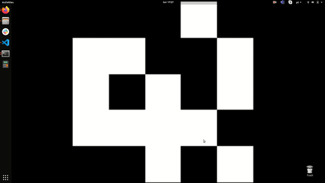

# Guia Linux básico 

       Este não é um curso regular de Linux, neste curso queremos ensinar conceitos básicos do Linux como navegar pelo sistema de arquivos e mostrar alguns exemplos básicos, mas com foco nas matérias de Robótica Computacional e Elementos de Sistemas para auxilia-los com os primeiros passos.    

## [Guia de como configurar o seu computador para subir o SSD ](https://github.com/Insper/404/tree/master/tutoriais/Boot_SSD_Config_BIOS)

Neste [link](https://github.com/Insper/404/tree/master/tutoriais/Boot_SSD_Config_BIOS) temos um passo a passo de como configurar o seu computador para subir o Sistema Operacional gravado no SSD externo disponibilizado pelos técnicos do laboratório

## [Atividade Complementar - Introdução ao Linux](https://github.com/liciascl/Linuxbasico/blob/master/atividade_complementar.md)

Neste [link](https://github.com/liciascl/Linuxbasico/blob/master/atividade_complementar.md) temos a parte teórica da *Atividade complementar - introdução ao Linux*

  

## [DESAFIO - Introdução ao Linux](https://github.com/liciascl/Linuxbasico/blob/master/desafio.md)

Após aprender os comandos básico, temos um desafio pra você, clique [aqui](https://github.com/liciascl/Linuxbasico/blob/master/desafio.md) e divirta-se!

  

## [Listamos aqui os comandos mais utilizados pra você consultar](https://github.com/liciascl/Linuxbasico/blob/master/colinha.md)

