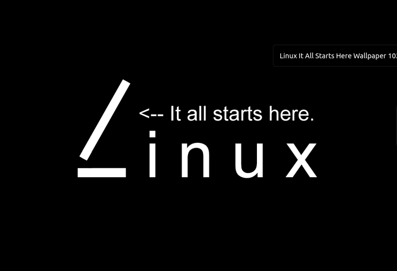
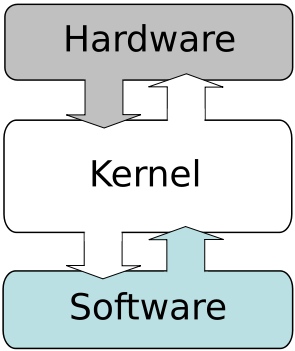
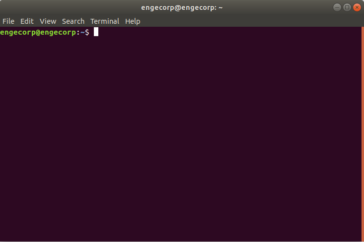
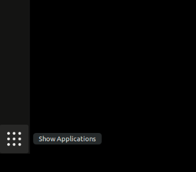
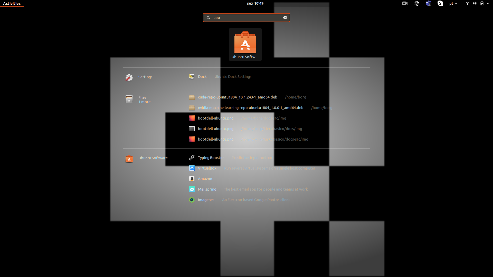
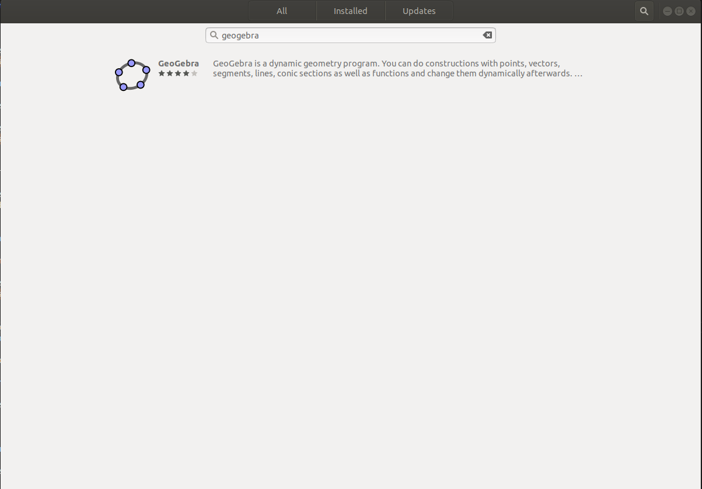
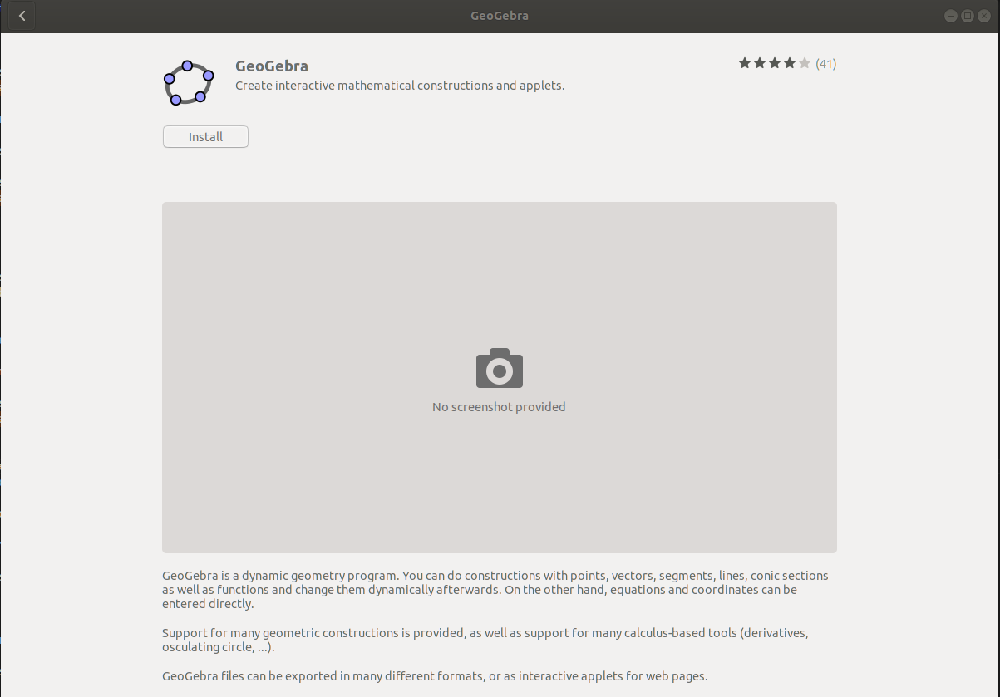
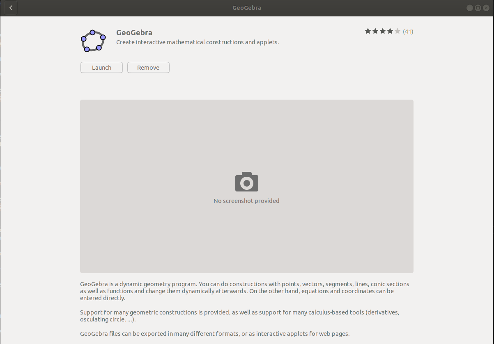
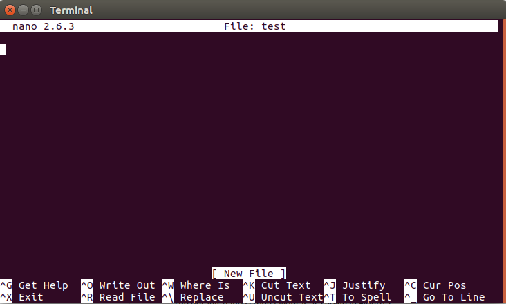

# Atividade Complementar - Introdução ao Linux

## Infraestrutura

> SSD disponibilizado 
> laptop, desktop, com acesso a Internet
> [Ter realizado os passos deste tutorial](https://liciascl.github.io/Linuxbasico/boot_do_ssd/)


## Linux 

{width=350}

O desenvolvimento do Linux é um dos exemplos mais proeminentes de colaboração de software livre e de código aberto. O código fonte pode ser usado, modificado e distribuído, com fins comercias ou não, por toda a comunidade, respeitando as licenças.

Normalmente, o Linux é utilizado como plataforma de desenvolvimento em sistemas embarcados


{width=350}
[Fonte](https://manjarobrasil.wordpress.com/2015/08/02/o-que-e-kernel/)


A distribuição linux ou Sistema Operacional que vamos usar será o Ubuntu. Existem diversas distribuições mas não será o nosso foco.


>É fácil achar maiores informações online, deixamos alguns links aqui mas não se restrinja apenas a eles:
>[link1](https://www.linuxfoundation.org/)
>[link2](https://pt.wikipedia.org/wiki/Distribui%C3%A7%C3%A3o_Linux#/media/Ficheiro:Linux_Distribution_Timeline.svg)
>[link3](https://boilingsteam.com/arch-manjaro-still-going-strong/)
>

## Conhecendo e utilizando o Terminal 

O Terminal do Linux é uma ferramenta que facilita a manipulação do sistema, interpretando os comandos do usuário, fazendo a ponte com o hardware do seu computador

## Abrindo o terminal

A forma mais facil de abrir o terminal é atraves do atalho:

<kbd>Ctrl</kbd> + <kbd>Alt</kbd> + <kbd>T</kbd>
 
Neste momento nos deparamos com a janela do terminal aberta no ambiente do usuário (home ou ~) pronta para receber os primeiros comandos.
{width=400}


## Comando "apt" 

`APT` é um conjunto de ferramentas usadas pelo Linux para administrar os pacotes `.deb` de forma automática, é possível instalar, atualizar e remover programas e suas dependências via apt;

### Atualizar a "lista de pacotes"

Com o comando abaixo, usamos o `apt` para atualizar todos os programas instalados com essa ferramenta;

```bash
sudo apt update 
```
### Atualiza pacotes "já instalados"

Com o comando abaixo, é possível baixar e instalar a versão mais atual de todos os programas instalados anteriormente via `apt`;

```bash
sudo apt upgrade 
```
### Instalar pacotes via apt

Com este comando, usamos o `apt` para encontrar, baixar e instalar o `.deb` do programa que queremos instalar no nosso computador;

```bash
sudo apt install -y geogebra 
```

Após finalizar a instalação do programa, podemos executar a nova ferramenta, apenas digitando o nome dela no terminal.

```bash
geogebra
```

### Remover pacotes via apt

Tambem é possivel desinstalar um programa que foi baixado via `apt`, basta usar o comando `remove`, como no exemplo abaixo;

```bash
sudo apt remove geogebra
```

### Instalar pacotes via Ubuntu Sftware

{width=100}

Podemos instalar pacotes via `Ubuntu Sftware`, basta clicar em Show Applications, no canto inferior direito da tela, e digitar `Ubuntu Sftware` na janela de busca;

1 - {width=400}


2 - {width=400}


Agora clique na lupinha e digite o programa que deseja instalar;

{width=400}


Clique no software escolhido, e depois, clique no botão Instalar;

{width=400}

Terminada a instalação, basta clicar no botão `Launch` para executar o programa, ou `Remove` para desinstalar;

{width=400}


## Um poquinho de GitHub

Antes começar a falar dos comandos do terminal, vamos configurar as nossas credenciais do GitHub, para isso copie os comandos abaixo e cole no terminal:

```bash
git config --global user.name "Seu Nome"
git config --global user.email "seunome@email.com"
```

> Se você está tentou usar <kbd>Ctrl</kbd> + <kbd>C</kbd> no texto e <kbd>Ctrl</kbd> + <kbd>V</kbd> no terminal, talvez não tenha dado muito certo.

> Para copiar e colar no terminal use:

> <kbd>Ctrl</kbd> + <kbd>Shift</kbd> + <kbd>C</kbd> (Copiar) e <kbd>Ctrl</kbd> + <kbd>Shift</kbd> + <kbd>V</kbd> (Colar). 

Sabendo disso, faça a configuração das suas credenciais no git copiando e colando o comando no terminal.

Para verificar se foi funcionou, digite:

```bash
git config user.name
git config user.email
```

>Este comando grava as suas credenciais do GitHub, para facilitar a sua vida na hora de enviar seus arquivos locais para o repositório remoto.


# Navegando entre diretorios e arquivos

De forma bem simplificada, podemos dizer que o sistema Linux possui 2 elementos principais: pastas e arquivos. Os arquivos armazenam dados (txt, py...) e as pastas tambem chamadas de diretórios, armazenam e organizam os arquivos. 
Sabendo disso é importante saber navegar entre os diretórios para encontrar os arquivos.


{width=400}

[Fonte](https://commons.wikimedia.org/wiki/File:FilesAndFolders.png)


## Comando "cd"

O comando **cd** é um dos comandos mais utilizados no terminal do Linux isso porque ele permite que acessemos um diretório especifico. Vamos acessar o nosso  repositorio de Elementos de Sistemas, e atualizar ele via git. 


```bash
cd Z01.1
```

```bash
git pull
```

É uma boa prática manter os seus repositórios Git sempre atualizados, antes de começar a trabalhar, não esqueça de dar um `git pull`, para ter certeza de que está trabalhando com a ultima versão dos arquivos no seu repositório!

Feita a atualização, vamos instalar uma ferramenta que permite visualizar toda a estrutaras de árvore da pasta, 

```bash
sudo apt install tree
```

Agora digite o comando para visualizar a árvore do repositório de Elementos de Sistemas:
```bash
tree -d -L 4
```

Esta ferramenta é útil para te ajudar a navegar de forma mais eficiente dentro do sistema, se você não sabe aonde determinado repositório está exatamente, é possivel consultar a árvore para localizar visualmente.


> os paramentros -d -L 2 indica que que queremos listar (-L )até o quarto (4) nível na hierarquia de pastas, apenas as pastas (-d)

> para listar tudo digite apenas tree.

Na pasta Z01.1 -> Projetos -> B-LogicaCombinacional -> src -> rtl estão os arquivos .hdl da ultima aula, vamos dar uma olhada neles. 

```bash
cd Projetos
cd B-LogicaCombinacional
cd src
cd rtl
```
ou par ir direto para este diretorio digite:

```bash
cd Projetos/B-LogicaCombinacional/src/rtl
```
> Dica:. Se estiver com preguiça de digitar o caminho completo, digite apenas o começo do comando e use a tecla <kbd>TAB</kbd> para auto-completar.

Para acessar o diretório anterior podemos digitar:

```bash
cd ..
```
## Comando "pwd"

Podemos verificar o diretório que estamos digitanto:

```bash
pwd
```

Para acessar o diretório home, basta digitar;

```bash
cd
```
> Toda vez que abrimos um novo terminal, ele é inicializado na home do usuário. 

## Comando "ls"

O comando **ls** é utilizado pra visualizar o conteúdo de um diretório. 
```bash
ls
```
# Visualização de arquivos e pastas ocultos

O comando "ls" sozinho não exibe arquivos ocultos, que são arquivos e pastas que começam com ".". Durante as aulas de robotica teremos que editar um arquivo oculto chamado "**.bashrc**", no momento precisamos apenas saber que este arquivo se encontra na home do usuario `~` e que após editado precisamos executar o `source ~/.bashrc` ou `feche o terminal e abra um novo` para recarregar as atualizações do arquivo. digite:

```bash
cd ~
ls -a
```
ou para listar informações mais detalhadas:

```bash
ls -la
```
ou simplismente:

```bash
ll
```
```bash
cd ~
code .bashrc
source .bashrc
```

## Comando "mkdir"

Para criar um novo diretório no ambiente em que você está, basta digitar o comando a seguir;

```bash
mkdir nome_da_pasta
```

Para criar um novo diretório em um local especifico, basta especificar o caminho que o diretório deverá ser criado;

> Dica:. Você sempre pode usar a tecla <kbd>TAB</kbd> para dar auto-completar os comandos.

```bash
mkdir /home/borg/Documents/nome_da_pasta 
```
ou

```bash
mkdir ~/Documents/nome_da_pasta 
```


## Comando "touch" 

O comando  **touch** cria arquivos vazios, na extensão que você definir;


```bash
touch teste.py
```

```bash
touch testando_outra_extensao.txt
```

O comando **>** funciona exatamente como o **touch**:

```bash

> outro_teste.py

```

```bash

> mais_um_teste.txt

```

Se você tentar abrir um arquivo que não existe, usando um editor de texto pelo terminal, o sistema cria o arquivo pra você, observe;

```bash

nano usando_o_nano.py
code usando_o_vscode.md
gedit o_bloco_de_notas.txt

```
## Comando "cp"

Para copiar arquivos e diretorios, basta  digitar:

```bash
> meu_programa_python.py 
cp -R meu_programa_python.py /home/borg/Documents/
```
No exemplo acima foi criado um arquivo chamado meu_programa_python.py uma copia do arquivo "nome1.py" dentro do diretório pasta1. 

## Comando "mv"

Para mover arquivos e diretorios, o famoso <kbd>Ctrl</kbd> + <kbd>X</kbd> / <kbd>Ctrl</kbd> + <kbd>V</kbd>, basta  digitar:

```bash
mv o_bloco_de_notas.txt /home/borg/Documents/
```
No exemplo acima o arquivo "o_bloco_de_notas.txt" foi movido para dentro do diretório Documents (recortado e colado).

## Comando "mv"

O comando **mv** tambem serve tanto para mover, com para renomear arquivos e diretorios:

```bash
mkdir pastinha
mv pastinha nova_pastinha
```
> Atenção!! Cuidado para não sobrescrever arquivos e pastas atuais na hora de executar estes comandos.

## Comando "rm"

Para excluir arquivos e diretórios, o famoso Shift+Del, basta digitar:

```bash
rm -rf nova_pastinha
```
> Atenção!! Cuidado!!!! Arquivos e pastas são apagados permanentemente, não vão para lixeira. No caso de diretórios, apaga o diretório e tudo que está dentro dele.

# Super Usuário

## Comando "sudo"
Por questões de seguraça, o Linux trabalha com permissões de usuários e para determinados arquivos ou comandos apenas o usuario administrador (root) pode executar. A titulo de curiosidade, "sudo" significa **S**uper **U**ser **DO**. Quando executar comandos com sudo, será necessário informar a senha.


## Comando "chmod"

As permissões servem para determinar se um usuario ou grupo terá permissões para ler, gravar, executar. Existem diversas configurações possiveis e a que mais utilizamos dá a permissão de execução a um codigo qualquer, como um python, por exemplo;

```bash
touch teste.py
chmod a+x teste.py
```
A concatenação de a+x significa que estamos permitindo para todos (a = all) usuarios e grupos executem (x = execution) o 
**teste.py**

# Editando arquivos

Existem várias ferramentas para edição de texto, de um modo geral, podemos dizer que existem 2 tipos grupos principais,
os que rodam direto no console (terminal) e os que possuem uma interface gráfica. 

## Editor nano 

O nano é um editor do modo console, ou seja, abre no proprio terminal. 

{width=400}

### Abrir
Digite no terminal **nano** e o nome do arquivo com a extensão, caso não exista um arquivo com esse nome um novo arquivo será criado.

```bash
nano nano.md
nano nano.txt
```

### Localizar palavra
Para fazer uma busca no texto pressione <kbd>Ctrl</kbd> + <kbd>W</kbd>, digite a palavra e aperte <kbd>Enter</kbd>.

### Salvar e Sair

Para salvar, precione <kbd>Ctrl</kbd> + <kbd>S</kbd>.
Para sair <kbd>Ctrl</kbd> + <kbd>X</kbd>.
Para sair sem salvar alteraçes,  <kbd>Ctrl</kbd> + <kbd>X</kbd> e  <kbd>N</kbd>.


## Editor gedit
Muito parecido com o famoso bloco de notas do Windows.

{width=400}

### Abrir
Digite no terminal **gedit** e o nome do arquivo com a extensão, caso não exista um arquivo com esse nome um novo arquivo será criado.

```bash
gedit roda_tartaruga.py
gedit roda_tartaruga.md
```
### Localizar palavra

Para fazer uma busca no texto pressione  <kbd>Ctrl</kbd> + <kbd>F</kbd>, digite a palavra e tecle <kbd>Enter</kbd>.

### Salvar e Sair

Para salvar e sair, pressione  <kbd>Ctrl</kbd> + <kbd>S</kbd> ou clique em salvar para salvar e para sair  <kbd>Alt</kbd> + <kbd>F4</kbd>

## Editor vscode

O editor vscode é uma ferramenta que possui mais recursos que auxiliam no desenvimento de codigo.

{width=400}

### Abrir

Digite no terminal **code** e o nome do arquivo com a extensão, caso não exista um arquivo com esse nome um novo arquivo será criado.

```bash
code roda_tartaruga.py
```
### Localizar palavra

Para fazer uma busca no texto pressione <kbd>Ctrl</kbd> + <kbd>F</kbd>, digite a palavra e tecle <kbd>Enter</kbd>.

### Salvar e Sair

Para salvar e sair, pressione  <kbd>Ctrl</kbd> + <kbd>S</kbd> ou clique em salvar para salvar e para sair  <kbd>Alt</kbd> + <kbd>F4</kbd>


# BONUS

Comando úteis para verificar informações do sistema, encontrar bugs, e matar programas travados; 

## Informações dos dispositivos conectados na USB

Se você não tem certeza se o dispositivo conectado a sua porta USB foi reconhecido, use este comando e verifique o log do sistema;

```bash
lsusb
```

## Informações dos dispositivos conectados na USB

Se você não tem certeza se o dispositivo conectado a sua porta PCI foi reconhecido, use este comando e verifique o log do sistema;

```bash
lspci
```


## O programa travou, e agora?

Para destravar uma tela, use "xkill" e clique na tela com o mouse.

```bash
xkill
```

Para matar um processo, digite o comando abaixo, e o nome do software que deseja assassinar;

```bash
pkill terminal
```

Preparamos um desafio para você, navega até a proxima página e divirta-se com a tartaruga do ROS


