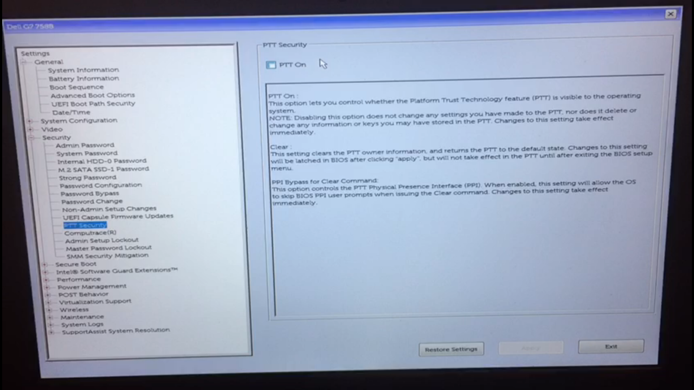
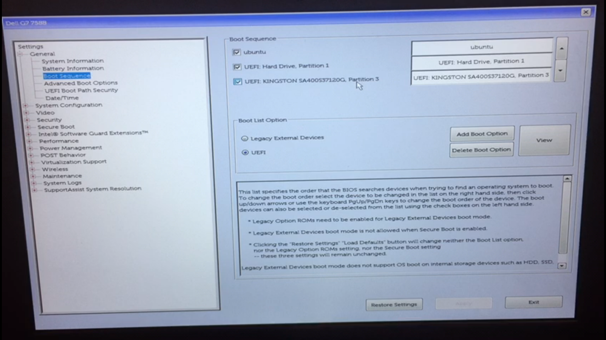

# Configurações de BIOS para Boot do SSD no Windows.

**ATENÇÃO!** 
Este guia de configuração é baseado em um notebook Dell, as teclas de atalho podem mudar no seu dispositivo, use este guia apenas como base, se tiver alguma dúvida, entre em contato com um dos técnicos de laboratório.

Lícia Sales
Email: liciascl@insper.edu.br
Teams: liciascl1

Arnaldo Junior
Email: arnaldoavj@insper.edu.br
Teams: arnaldo.junior2

>De forma geral, este procedimento pode ser reproduzido em notebooks de outras marcas, sendo feitas as adaptações para cada BIOS.

## Desabilitando o BitLocker

Com o Windowns inicializado, pesquise por **Bitlocker** no menu iniciar. 

O Bitlocker deve estar desabilitado, como aparece na imagem abaixo. Se o BitLocker estiver ligado, **Desligue**.

    

## Acessando a BIOS

Para acessar a BIOS, é necessário que;

1. Desligue o notebook completamente;
2. Concecte o SSD na porta USB (preferencialmente 3.0);
3. Ligue o notebook;
4. Assim que a logomarca do seu dispositivo aparecer, pressione varias vezes a tecla de acesso a bios, em notebooks dell é <kbd>F2</kbd>  

Quando pressionar a tecla de acesso a bios <kbd>F2</kbd>  irá aparecer uma mensagem no canto superior direito. 

Logo depois, seremos direcionados a Bios do dispositivo. Cada fabricante tem uma interface diferente, use este guia apenas como base.

> Para maquinas diferentes de Dell, é esperado que a interface da Bios seja diferente.

## Configurando a BIOS

Vá em *Security* --> *PPT Security*: Deixe a opção *PPT On* desmarcada.

Em *General* --> *Boot Sequence*: Verifique se aparece marcada a opção **UEFI: kingston ....... Partition 3**, igual a imagem abaixo.  

Salves as alterações em **Aplly** e **Exit** para sair da BIOS e reinicie o computador. 

## Inicializando o SSD

Para inicialiar o boot pelo SSD, é necessário:

1. Desligar o notebook completamente;
2. Concectar o SSD na porta USB (preferencialmente 3.0);
3. Ligar o notebook;
4. Assim que a logomarca do seu dispositivo aparecer, pressione varias vezes a tecla de acesso ao boot menu, em notebooks dell é <kbd>F12</kbd>  

Quando pressionar a tecla de acesso ao boot menu, (em notebooks dell <kbd>F12</kbd> ) irá aparecer uma mensagem no canto superior direito. 

5. Nas opções de Boot escolha a opção **UEFI: kingston ....... Partition 3** e pressione ENTER. 

6. Irá carregar a tela de grub do linux. Não é preciso alterar nada, apenas pressione ENTER. 

Linux irá inicializar.

Agora podemos usar o Linux para atividades do semestre.

Bons estudos!!!
