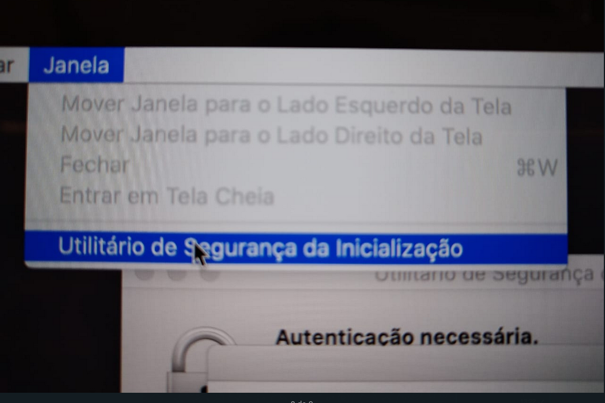
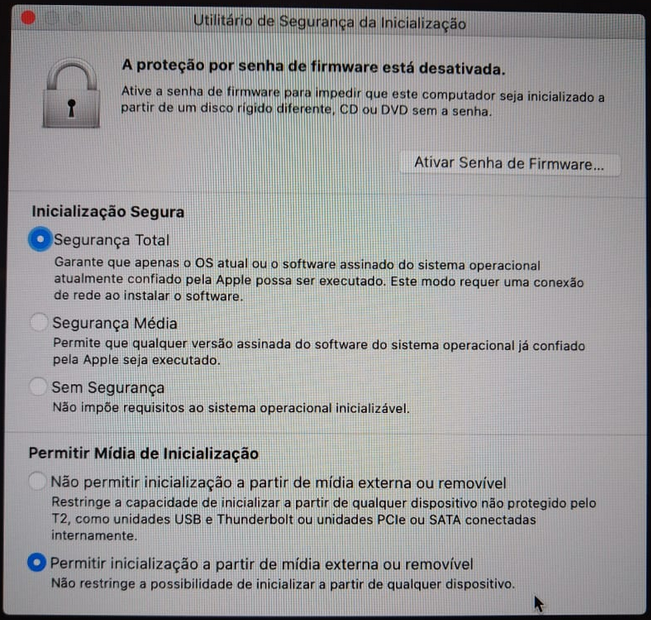
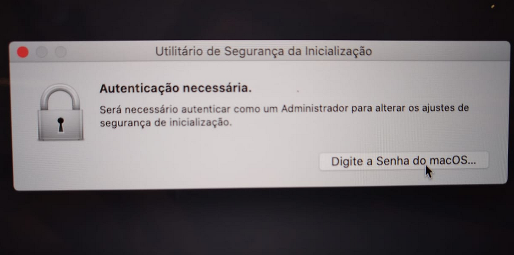
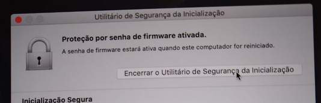
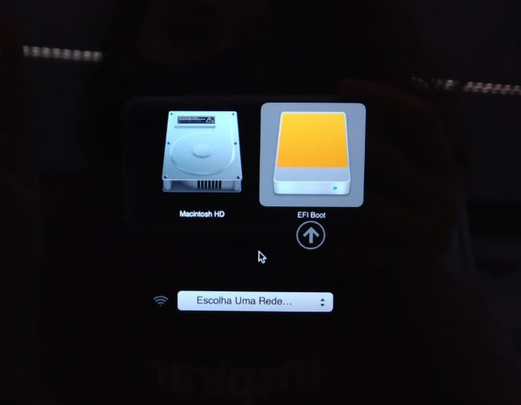
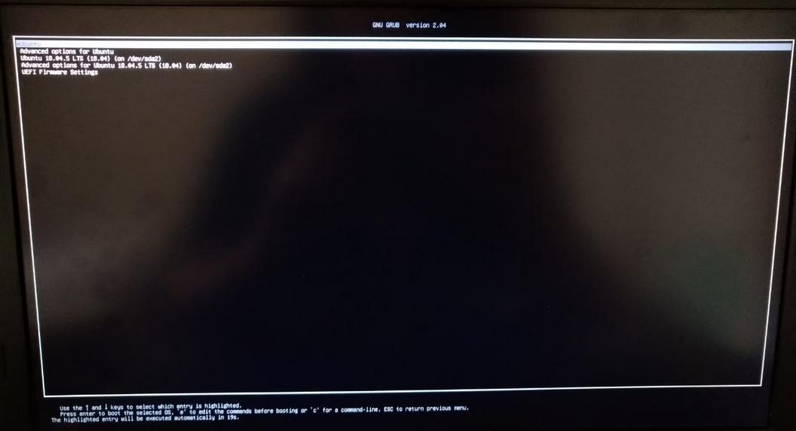
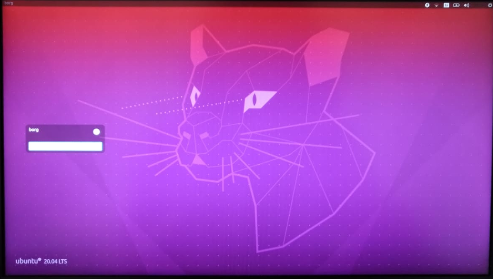

# Configurações no MacOs para Boot do SSD 

### O que vamos precisar:

- Hub usb
- teclado externo
- mouse externo
- Adaptador Wifi usb

**ATENÇÃO**
A etapa **Habilitando uso de midia externa para inicialização** só é necessaria para Macbook Pro 2019 +
caso vc tenha alguma outra versão de Macbook, pule direto para a **Entrando no Gerenciador de inicialização**

### Habilitando uso de midia externa para inicialização

Ao ligar o seu dispositivo, pressione e segure as teclas <kbd>Command(⌘)</kbd> + <kbd>R</kbd>

Vá em **Janela**, depois procure a opção **Utilitário de Segurança da Inicialização**

Selecione a opção **Permitir inicialização a partir de mídia externa ou removível**

{width=800}

Clique em **Ativar Senha de Firmware** Você vai precisar configurar uma senha, ela será usada toda vez que você precisar subir o Linux no seu MacOs

{width=800}

Clique em **Encerrar o Utilitário de Segurança da inicialização** 

{width=800}

### Entrando no Gerenciador de inicialização

Ao ligar o seu dispositivo, com o SSD plugado, pressione e segure a teclas  <kbd>Option(⌥)</kbd> ou <kbd>Alt</kbd>
Ao entrar na tela que permite selecionar outros volumes ou discos de inicialização, selecione a opção EFI boot 
Se o Mac estiver usando uma senha de firmware, você precisará inserir a senha.

{width=800}

Quando aparecer esta tela, apenas aperte <kbd>Enter</kbd>

{width=800}

Aguarde esta tela aparecer, a senha de login está do folder que acompanha o SSD, bons estudos!

{width=800}

Caso tenha alguma dúvida ou precise de ajuda, entre em contato conosco via Teams ou Email:

Lícia Sales
Email: liciascl@insper.edu.br
Teams: liciascl1

Arnaldo Junior
Email: arnaldoavj@insper.edu.br
Teams: arnaldo.junior2

