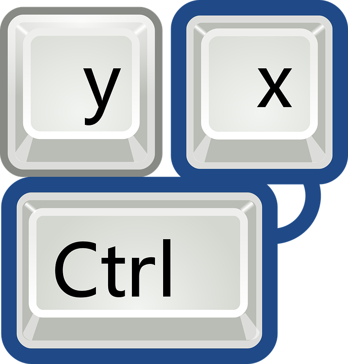

# Colinha com os comandos da Atividade Complementar

Listamos aqui os comandos mais utilizados pra você consultar 





Abra um terminal novo, usando o atalho Crtl + T

<kbd>Ctrl</kbd> + <kbd>T</kbd>


Abra uma aba no terminal que ja existe, Crtl + Shift + T

<kbd>Ctrl</kbd> + <kbd>Shift </kbd> + <kbd>T</kbd>


Para entrar numa pasta

```bash
cd nome_da_pasta_mãe

ou

cd nome_da_pasta_mãe/nome_da_pasta_filha/nome_da_pasta_infinitamente

```

Se quiser ir até uma pasta que está no diretório Home


```bash
cd ~

ou

cd /home/

```

Se quiser saber aonde você está

```bash
pwd

```

Se quiser voltar uma pasta

```bash
cd ..

```

Se quiser voltar duas pastas

```bash
cd ../..

```

Para saber o conteúdo do diretório


```bash
ls

```

Para saber o conteúdo do diretório de forma mais detalhada


```bash
ls -a

ou

ls -la

ou ainda

ll

```

Para remover arquivos permanetemente

```bash
rm -rf

```


Para mover o arquivo de diretório:


```bash
mv ~/local_do_arquivo/nome.py ~/novo_local/nome.py

```


Para apenas renomear arquivo :


```bash
mv ~/local_do_arquivo/nome.py ~/local_do_arquivo/nome_novo.py

```

Para renomear e mover o arquivo de diretório:


```bash
mv ~/local_do_arquivo/nome.py ~/novo_local/nome_novo.py

```

Criando ou abrindo arquivos com o seu editor de texto favorito

```bash

nano mais_um_teste.py
code esta_acabando_a_criatividade.py
gedit socorro.py


```

Para recarregar o .bashrc

```bash

source ~/.bashrc

```

Para instalar pacotes disponíveis via apt


```bash
sudo apt-get install nome_do_pacote

```


Para desinstalar pacotes disponíveis via apt

```bash
sudo apt-get remove nome_do_pacote

```

Informações dos dispositivos conectados na USB 

```bash
lsusb

```
Informações dos dispositivos conectados na PCI

```bash
lspci

```

Para destravar uma tela, use "xkill" e clique na tela com o mouse.


```bash
xkill

```

Para alterar as permissões dos arquivos e diretórios


```bash
chmod a+x roda_tartaruga.py

```
*este comando libera a permissão para o arquivo se tornar executável, para outras opções de permissão, consulte o [guialinux](https://guialinux.uniriotec.br/chmod/)*
