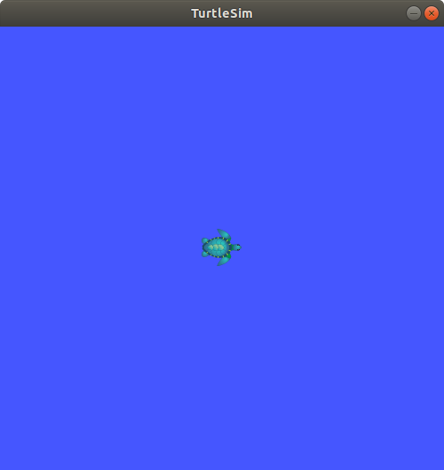
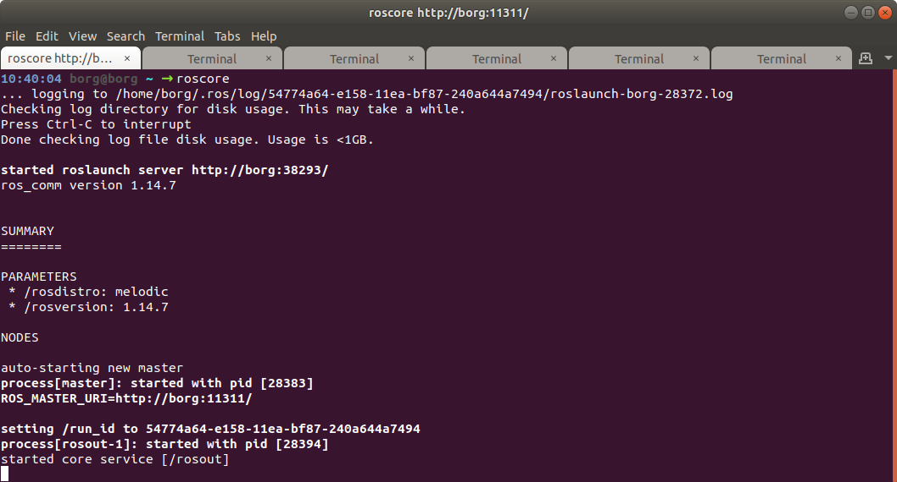
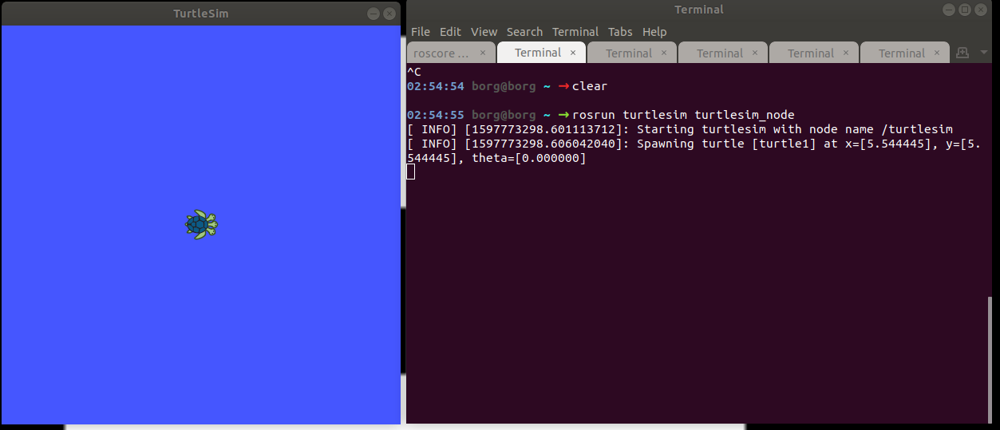
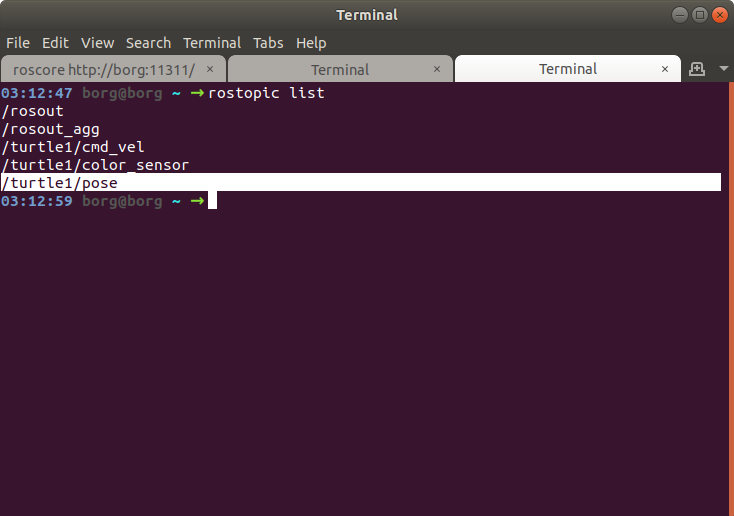
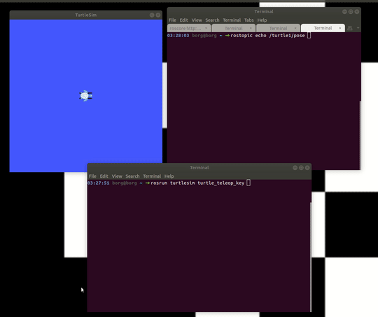
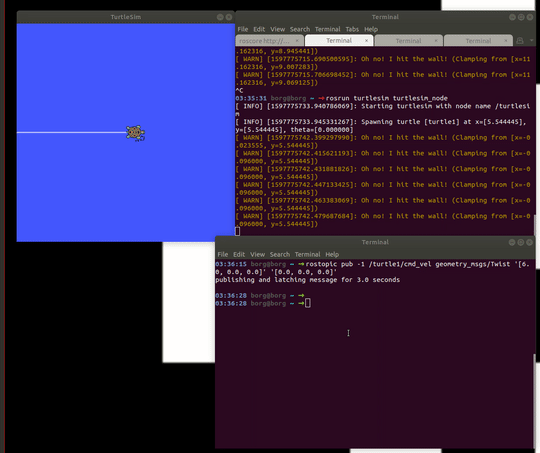

# DESAFIO - Introdução ao Linux 

Agora que conhecemos alguns comandos, podemos configurar o nosso `.bashrc`,  para brincar com a tartaruga do ROS!

{width=600}

## Configurando o ´.bashrc´

O .bashrc carrega todas as variáveis globais do seu ambiente Linux, esse arquivo é muito importante, e muito utilizado. 
Para acessar o bashrc, use o comando abaixo

```bash
code ~/.bashrc
```
Perceba que la no final do arquivo, temos algo como;

```bash
##########################
# 3s
##########################

source ~/elementos.sh
source ~/robotica.sh
```

Isso é porque estamos ativando esses arquivos que estão localizados na home, eles sobem configurações especificas para o ambiente, tanto da matéria de Robótica, como da matéria de Elementos de Sistemas, deixamos separado desta forma pra facilitar a manutenção e pra deixar mais organizado.

Para subir a tartaruga do ROS, precisamos configurar o nosso `robotica.sh`, primeiro, abra o arquivo `robotica.sh`, usando o comando abaixo;


```bash
code ~/robotica.sh
```


Depois, procure essas linhas, e comente, conforme imagem abaixo;


{width=1000}


Salve e feche o arquivo.


## Inicializando o ROS

Abra um terminal novo, usando o atalho <kbd>Crtl</kbd> + <kbd>T</kbd>, neste terminal, execute o comando a seguir para criar uma "Rede ROS"


``` bash
roscore
```


Seu resultado deve ser algo parecido com isso:


{width=1000}


## Subindo o TurtleSim

Em uma nova aba do terminal (<kbd>Crtl</kbd> + <kbd>Shift</kbd> + <kbd>T</kbd>), vamos chamar a tartaruga com o comando abaixo:


``` bash
rosrun turtlesim turtlesim_node 
```


Seu resultado deve ser algo parecido com isso;


{width=1000}


## Listando os topicos disponíveis

Nós veremos com maior profundidade as funcionalidades do ROS durante o curso de Robótica Computacional, mas é legal saber, que podemos acessar os sensores dos nossos robôs, tanto dos virtuais como dos reais, com o comando abaixo;


``` bash
rostopic list
```


{width=1000}


Com o *rostopic list* temos acesso a todos os tópicos disponíveis, tanto para visualizar, como para publicar novos valores nos sensores, usaremos dois tópicos nesta atividade;


- `/turtle1/pose`, para visualizar aonde nossa tartaruga está no mapa;

- `/turtle1/cmd_vel`, para publicar novos valores de relocidade angular e velocidade linear em nossa tartaruga;


## Acessando os Sensores da tartaruga

Digite o comando abaixo em uma nova aba do seu terminal <kbd>Crtl</kbd> + <kbd>Shift</kbd> + <kbd>T</kbd>), para acessar os sensores de velocidade e de posição da tartaruga


``` bash
rostopic echo /turtle1/pose 
```


Depois, em um terminal novo (<kbd>Crtl</kbd> + <kbd>T</kbd>), digite o comando a seguir, use as setas do seu teclado para mover a tartaruga, e observe os valores de velocidade e de posição, alternarem no terminal aberto no passo anterior.


``` bash
rosrun turtlesim turtle_teleop_key 
```


Seu resultado deve ser algo parecido com isso;


{width=1000}


Com o comando abaixo, podemos publicar valores de velocidade angular e linear na nossa tartaruga, só tome cuidado pra não bater ela na parede, ela reclama!


``` bash
rostopic pub -1 /turtle1/cmd_vel geometry_msgs/Twist '[4.0, 0.0, 0.0]' '[0.0, 0.0, 0.0]'
```


Durante a disciplina de Robótica, esses comandos serão vistos em maiores detalhes, mas é importante saber, que estamos enviando um vetor contendo


- Velocidade Linear em X, Y, Z;
- Velocidade Angular em X, Y, Z;


A tartaruga aceita valores do tipo Float, positivios e negativos, altere os valores publicados, perceba como ele altera o comportamento da tartaruga


{width=1000}


## Vamos programar!

Abra o arquivo `roda_tartaruga.py` criado com muito carinho, na atividade anterior;


``` bash
code roda_tartaruga.py
```

Cole o codigo abaixo dentro do seu arquivo:


``` bash
#!/usr/bin/env python

import rospy
from geometry_msgs.msg import Twist
import sys
ja_rodou=0

def move_turtle(lin_vel,ang_vel,sleep):
    rospy.init_node('move_turtle', anonymous=True)
    pub = rospy.Publisher('/turtle1/cmd_vel', Twist, queue_size=3)

    vel = Twist()       

    vel.linear.x = lin_vel # Velocidade linear
    vel.linear.y = 0
    vel.linear.z = 0

    vel.angular.x = 0
    vel.angular.y = 0
    vel.angular.z = ang_vel  # Velocidade angular

    rospy.loginfo("Linear Vel = %f: Angular Vel = %f",lin_vel,ang_vel)

    pub.publish(vel)
    rospy.sleep(sleep)


if __name__ == '__main__':

     while not rospy.is_shutdown():
        move_turtle(6.5,6.5,1.0)
```


Com o `roscore` aberto em um terminal:


``` bash
roscore
```


E a sua tartaruga aberta em outro:


``` bash
rosrun turtlesim turtlesim_node 
```


Execute o seu programa `roda_tartaruga.py`;


``` bash
./roda_tartaruga.py
```


ou


``` bash
python roda_tartaruga.py
```


Funcionou!???


# Hora do desafio!

Analise o código disponibilizado, altere os comandos e faça a nossa bela tartaruga desenhar um 8 na tela, use a sua criatividade e os seus conhecimentos em python, divirta-se!


{width=600}
